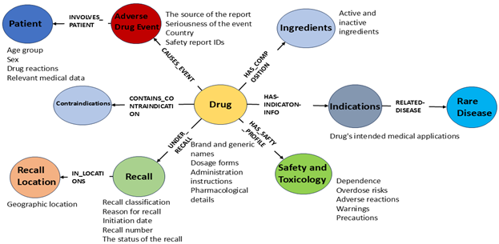

# RDAS_FAERS Data Model Documentation

## Overview
This documentation provides an overview of the data model developed for the **RDAS_FAERS** project, designed to capture relationships between orphan drugs, their designations, and rare diseases in alignment with adverse drug events (ADE) data. By leveraging data from the **FAERS Public Dashboard**, this model establishes structured associations that help reveal insights into the safety, labeling, and usage of orphan drugs in rare disease contexts.

## Methodology
The **FAERS Public Dashboard** grants access to four essential datasets:
1. **Human Drug Adverse Events**
2. **Drug Labeling**
3. **National Drug Code Directory**
4. **Drug Recall Enforcement Reports**

To map relationships between orphan drugs and rare diseases, we gathered orphan drug designation and approval data from the **FDA**. Using this, we mapped rare diseases listed by the **Genetic and Rare Diseases (GARD) Information Center** to the “Approved Labeled Indication” and “Orphan Designation” labels of FDA-approved orphan drugs through exact string matching. Examples of this mapping can be found in Table 1.

### Example of Mappings (Table 1)
| Orphan Designation                             | Mapped Rare Diseases                                        |
|-----------------------------------------------|-------------------------------------------------------------|
| Treatment of retinopathy of prematurity       | Retinopathy of prematurity (GARD ID: 0005695)               |
| Treatment of idiopathic pulmonary fibrosis    | Idiopathic pulmonary fibrosis (GARD ID: 0008609)            |
| Treatment of cutaneous variants of porphyria  | Porphyria (GARD ID: 0010353)                                |

## Data Model Design
Based on our analysis, we defined a data model to represent the relationships among these datasets semantically. The model, depicted in Figure 1, is structured around ten primary classes (shown as nodes) with associated data properties specific to drug safety and adverse events (ADE). Each node represents a unique concept, with edges capturing the semantic relationships between these nodes. 

Table 2 lists the primary classes and their associated data properties.

### Data Model Components (Table 2)
| Primary Class          | Associated Data Properties                                                                 |
|------------------------|---------------------------------------------------------------------------------------------|
| **Patient**            | Age group, death date, onset age, sex, weight, reaction                                     |
| **Recall Location**    | Address 1, address 2, city, country, state                                                  |
| **Drug Recall**        | Reason for recall, recall initiation date, report date, termination date                    |
| **Adverse Drug Event** | Primary source qualification, primary source country, serious, receive date                 |
| **Drug**               | Brand name, dosage, form, generic name, indications, mechanism, NDC, drug interactions      |
| **Safety and Toxicology** | Adverse reactions, warnings, specific population usage                                  |
| **Drug Ingredients**   | Active ingredient, inactive ingredient, SPL elements, strength                             |
| **Contraindications**  | Contraindications                                                                          |
| **Indications**        | Drug indication, orphan designation                                                        |

