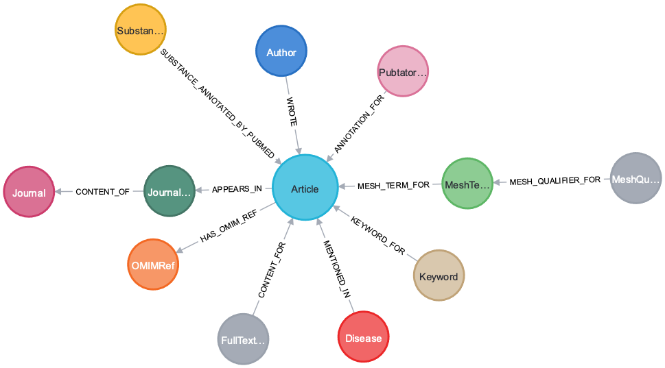

# Introduction
One of the target of the alert project is to load all PubMed articles related to rare diseases to a knowledge graph database - Neo4j. Here we use `Python` and third party `API` to parse and load all the information on-the-fly to Neo4j database.


# Architecture
## Data Source
The following data sources are used to build this Neo4j database:
- GARD data lake.
- NCBI.
  - NCBI eutils
  - NCBI Pubtator
- EBI
- OMIM

Rare diseases related information such as GARD_ID and Name are returned by cypher query against GARD data lake Neo4j database. Disease name is used to query NCBI PubMed archieve to get a list of PubMed article IDs. Because of the large number of articles for same diseases, we limit the number of articles for each disease to 1000.

EBI, instead of NCBI PubMed archieve and `APIs` are used to get the article informaiton, such as title, keywords, abstract, etc. because of the following reseans:
1. NCBI has limitation on how many `API` calls can make in one second (around 3 per second).
2. EBI does not have such limit and it also provids an `API` that can query/return as much as 1000 PubMed articles.

Pubtator `API` is used to get further annotations such as MESH term and Gene for an article. There is also a limit (3 calls per second) for how often the `API` can be called. The loading program force itself to sleep for a while (0.34 second) between the calls.

OMIM `APIs` are used to get all the OMIM reference PubMed articles for rare diseases. These articles are then checked against what have loaded into the Neo4j, and the missing ones are loaded using the same procedure.

## Data Flow
The following chart gives the how and what kind of data is collected and load into Neo4j:


# Neo4j Data Model
The data model or schema show all the nodes and their relationships.


# Source Codes
## Python packages required for runnin the PubMed article loading program
The following packages and their versions from `alert-requirements.txt` file are the required python packages for running the loading program to laod PubMed articles related information to Neo4j:
```
certifi==2021.10.8
charset-normalizer==2.0.7
idna==3.3
jmespath==0.10.0
neo4j==1.7.6
neobolt==1.7.17
neotime==1.7.4
pytz==2021.3
requests==2.26.0
six==1.16.0
urllib3==1.26.7
```
## Python packages required for running machine learning model
To run the Neural Network machine learning model to add `isEpi` property for each article node in Neo4j, the following pakcage and their versions are needed as in file `epi-requirements.txt`
```
absl-py==1.0.0
astunparse==1.6.3
blis==0.7.5
cachetools==4.2.4
catalogue==2.0.6
certifi==2021.10.8
charset-normalizer==2.0.9
click==7.1.2
cycler==0.11.0
cymem==2.0.6
en-core-web-lg @ https://github.com/explosion/spacy-models/releases/download/en_core_web_lg-3.0.0/en_core_web_lg-3.0.0-py3-none-any.whl
en-core-web-md @ https://github.com/explosion/spacy-models/releases/download/en_core_web_md-3.0.0/en_core_web_md-3.0.0-py3-none-any.whl
en-core-web-sm @ https://github.com/explosion/spacy-models/releases/download/en_core_web_sm-3.0.0/en_core_web_sm-3.0.0-py3-none-any.whl
en-ner-bc5cdr-md @ https://s3-us-west-2.amazonaws.com/ai2-s2-scispacy/releases/v0.4.0/en_ner_bc5cdr_md-0.4.0.tar.gz
en-ner-bionlp13cg-md @ https://s3-us-west-2.amazonaws.com/ai2-s2-scispacy/releases/v0.4.0/en_ner_bionlp13cg_md-0.4.0.tar.gz
et-xmlfile==1.1.0
flatbuffers==2.0
fonttools==4.28.5
gast==0.4.0
google-auth==2.3.3
google-auth-oauthlib==0.4.6
google-pasta==0.2.0
grpcio==1.42.0
h5py==3.6.0
idna==3.3
importlib-metadata==4.8.2
Jinja2==3.0.3
jmespath==0.10.0
joblib==1.1.0
keras==2.7.0
Keras-Preprocessing==1.1.2
kiwisolver==1.3.2
langcodes==3.3.0
libclang==12.0.0
Markdown==3.3.6
MarkupSafe==2.0.1
matplotlib==3.5.1
murmurhash==1.0.6
neo4j==4.4.0
nltk==3.6.5
numpy==1.21.4
oauthlib==3.1.1
openpyxl==3.0.9
opt-einsum==3.3.0
packaging==21.3
pandas==1.3.5
pathy==0.6.1
Pillow==9.0.0
preshed==3.0.6
protobuf==3.19.1
pyasn1==0.4.8
pyasn1-modules==0.2.8
pydantic==1.8.2
pyparsing==3.0.6
python-dateutil==2.8.2
pytz==2021.3
regex==2021.11.10
requests==2.26.0
requests-oauthlib==1.3.0
rsa==4.8
scikit-learn==1.0.2
scipy==1.7.3
six==1.16.0
sklearn==0.0
smart-open==5.2.1
spacy==3.0.7
spacy-legacy==3.0.8
spacy-loggers==1.0.1
srsly==2.4.2
tensorboard==2.7.0
tensorboard-data-server==0.6.1
tensorboard-plugin-wit==1.8.0
tensorflow==2.7.0
tensorflow-estimator==2.7.0
tensorflow-io-gcs-filesystem==0.23.0
termcolor==1.1.0
thinc==8.0.13
threadpoolctl==3.0.0
tqdm==4.62.3
typer==0.3.2
typing_extensions==4.0.1
urllib3==1.26.7
wasabi==0.9.0
Werkzeug==2.0.2
wrapt==1.13.3
zipp==3.6.0
```
## `initial_loading.py`
The is the main program to run for laoding PubMed articles for all rare diseases. The rare diseases list comes from Neo4j data lake at https://disease.ncats.io

`from_disease` and `to_disease` control what's the range of disease to handle. For testing, these can be set to a small range. For handle all the rare diseases, set them to `0` and `None`

`mindate` and `maxdate` control the time period of PubMed articles. The first run of this program has values `1900/01/01` and `2021/08/31`

## `load-substance.py`
The `initial_loading.py` code did not load "substance" from the API call. This program - `load-substance.py` loop through all the pubmedIDs in current Neo4j database and call the EBI API to get substance information from `chemicalList` of the returned JSON object and add new property to `Article` node.

## `load-pubtype.py`
Again, the `initial_loading.py` code did not load "pubtype" from the API call. This program - `load-pubtype.py` loop through all the pubmedIDs in current Neo4j database and call the EBI API to get pubType information from `pubTypeList` of the returned JSON object and add new property to `Article` node.

## `alert_add_epi.py`

## `neo4j_access` folder

## `saved_model` folder
This folder hold the trainned model of Neural Network for classify if an PubMed article is epidimiology related study or not. The `my_model_orphanet_final` is the actual model used in `alert_add_epi.py`

## `api` folder
This folder is for backend python code for connecting to multiple Neo4j databases and provide a general, easy, wrapped way to access rare disease related infomation. It will support the following two use cases, for now:
- Alert web application.
- Rare diseases public APIs for research community.

`neo4j_backend.py` is an example python class for access Neo4j with `cypher` query. `test_neo4j_backend.py` is just a test class on how to use `neo4j_backend.py`

# Publication
[Q. Zhu et al., "Scientific Evidence Based Knowledge Graph in Rare Diseases," 2021 IEEE International Conference on Bioinformatics and Biomedicine (BIBM), 2021, pp. 2614-2617, doi: 10.1109/BIBM52615.2021.9669645.](https://ieeexplore.ieee.org/document/9669645)
