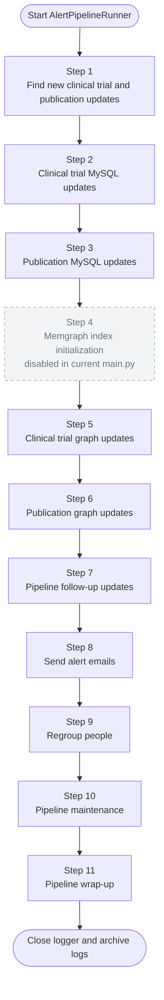

# RDAS Alert Pipeline Diagram

This document reflects the current runtime order in `Z_Alert/main.py` and the
task classes under `Z_Alert/pipelines/`.

`AlertPipelineRunner` owns the high-level order. `PipelineRunnerBase` wraps each
high-level step with `_run_step_with_timing()`, and `_run_pipeline_task()` runs
each task class by instantiating it, calling `process_new_data()`, and closing
the task when needed.

## Main Runtime Flow

## Expanded Task Flow

```mermaid
flowchart TD
    start([Start AlertPipelineRunner])

    subgraph step1["Step 1 - run_find_new_clinical_trial_and_publication_updates"]
        s1_gard["GardNodeNamesTask<br/>read GARD nodes in batches"]
        s1_normalize["Normalize each GARD node<br/>filtered_names + updated date"]
        s1_ct["NewClinicalTrialDiscoveryTask<br/>find_new_data(gard_node)"]
        s1_pub["NewPublicationDiscoveryTask<br/>find_new_data(gard_node)"]
        s1_done(("Step 1 complete"))

        s1_gard --> s1_normalize
        s1_normalize --> s1_ct
        s1_normalize --> s1_pub
        s1_ct --> s1_done
        s1_pub --> s1_done
    end

    subgraph step2["Step 2 - run_clinical_trial_mysql_updates"]
        s2_1["NewClinicalTrialImportTask"]
        s2_2["ClinicalTrialDrugInterventionMappingTask"]
        s2_3["ClinicalTrialPublicationMappingTask"]
        s2_4["ClinicalTrialPmidArticleImportTask"]
        s2_5["NewClinicalTrialAnnotationTask"]

        s2_1 --> s2_2 --> s2_3 --> s2_4 --> s2_5
    end

    subgraph step3["Step 3 - run_publication_mysql_updates"]
        s3_1["PublicationEpiNhsClassificationTask"]
        s3_2["GardOmimPublicationMappingTask"]
        s3_3["PublicationOminDataRetrievalTask"]
        s3_4["NewPublicationPubtatorRetrievalTask"]
        s3_5["NewPublicationChemicalSubstanceTask"]
        s3_6["PublicationFalsePositiveFilterTask"]
        s3_7["NewOmimPublicationArticleImportTask"]

        s3_1 --> s3_2 --> s3_3 --> s3_4 --> s3_5 --> s3_6 --> s3_7
    end

    subgraph step4["Step 4 - run_memgraph_index_initialization"]
        s4_1["Disabled logging lambda in __main__"]
        s4_2["MemgraphIndexInitializationTask<br/>exists if the runner call is re-enabled"]

        s4_1 -. disabled .-> s4_2
    end

    subgraph step5["Step 5 - run_clinical_trial_graph_updates"]
        s5_1["NewClinicalTrialGraphTask"]
        s5_2["NewClinicalTrialGardRelationshipTask"]
        s5_3["NewClinicalTrialConditionGraphTask"]
        s5_4["NewClinicalTrialInterventionGraphTask"]
        s5_5["NewClinicalTrialDrugGraphTask"]
        s5_6["NewClinicalTrialParticipantGraphTask"]
        s5_7["NewClinicalTrialPrimaryOutcomeGraphTask"]
        s5_8["NewClinicalTrialStudyDesignGraphTask"]
        s5_9["NewClinicalTrialIndividualPatientDataGraphTask"]
        s5_10["NewClinicalTrialAnnotationGraphTask"]
        s5_11["NewClinicalTrialOrganizationLocationGraphTask"]

        s5_1 --> s5_2 --> s5_3 --> s5_4 --> s5_5 --> s5_6 --> s5_7 --> s5_8 --> s5_9 --> s5_10 --> s5_11
    end

    subgraph step6["Step 6 - run_publication_graph_updates"]
        s6_1["NewPublicationArticleGraphTask"]
        s6_2["NewPublicationArticleNodeAttrsUpdateTask"]
        s6_3["NewPublicationEpidemiologyGraphTask"]
        s6_4["NewPublicationKeywordGraphTask"]
        s6_5["NewPublicationJournalGraphTask"]
        s6_6["NewPublicationMeshTermGraphTask"]
        s6_7["GardPublicationEpiNhsCountUpdateTask"]
        s6_8["NewPublicationGardArticleRelationshipTask"]
        s6_9["NewPublicationPubtatorGraphTask"]
        s6_10["NewPublicationSubstanceGraphTask"]
        s6_11["NewPublicationOmimRefGraphTask"]

        s6_1 --> s6_2 --> s6_3 --> s6_4 --> s6_5 --> s6_6 --> s6_7 --> s6_8 --> s6_9 --> s6_10 --> s6_11
    end

    subgraph step7["Step 7 - run_pipeline_followup_updates"]
        s7_1["GardRelationshipCountRefreshTask"]
        s7_2["ArticleGeneReviewFlagUpdateTask"]
        s7_3["DiseaseCountsRefreshTask"]
        s7_4["DashboardFieldCountsRefreshTask"]

        s7_1 --> s7_2 --> s7_3 --> s7_4
    end

    subgraph step8["Step 8 - send_alert_emails"]
        s8_1["AlertSender"]
        s8_2["find_new_and_send_alert()"]

        s8_1 --> s8_2
    end

    subgraph step9["Step 9 - run_regroup_the_person"]
        s9_1["NewPublicationPersonTask"]
        s9_2["NewClinicalTrialPersonTask"]
        s9_3["NewGrantPersonTask"]
        s9_4["NewPersonGroupingTask"]
        s9_5["NewPersonAgentGraphTask"]

        s9_1 --> s9_2 --> s9_3 --> s9_4 --> s9_5
    end

    subgraph step10["Step 10 - run_pipeline_maintenance"]
        s10_1["OrganizationLocationRorLookupTask"]
        s10_2["OrganizationLocationGraphSyncTask"]
        s10_3["NewOrganizationSourceTrackingTask"]

        s10_1 --> s10_2 --> s10_3
    end

    subgraph step11["Step 11 - run_pipeline_wrapup"]
        s11_1["ClinicalTrialPipelineWrapUpTask"]
        s11_2["PublicationPipelineWrapUpTask"]
        s11_3["PersonPipelineWrapUpTask"]
        s11_4["OrganizationLocationMaintenanceWrapUpTask"]

        s11_1 --> s11_2 --> s11_3 --> s11_4
    end

    finish([Close runner logger and archive logs])

    start --> s1_gard
    s1_done --> s2_1
    s2_5 --> s3_1
    s3_7 --> s4_1
    s4_1 --> s5_1
    s5_11 --> s6_1
    s6_11 --> s7_1
    s7_4 --> s8_1
    s8_2 --> s9_1
    s9_5 --> s10_1
    s10_3 --> s11_1
    s11_4 --> finish

    classDef disabled fill:#f3f4f6,stroke:#9ca3af,color:#6b7280,stroke-dasharray: 5 5;
    class s4_1,s4_2 disabled;
```

## Step Order Reference

| Step | Runner method | Task order |
| --- | --- | --- |
| 1 | `run_find_new_clinical_trial_and_publication_updates()` | `GardNodeNamesTask`, then per GARD node: `NewClinicalTrialDiscoveryTask.find_new_data(gard_node)` and `NewPublicationDiscoveryTask.find_new_data(gard_node)` |
| 2 | `run_clinical_trial_mysql_updates()` | `NewClinicalTrialImportTask` -> `ClinicalTrialDrugInterventionMappingTask` -> `ClinicalTrialPublicationMappingTask` -> `ClinicalTrialPmidArticleImportTask` -> `NewClinicalTrialAnnotationTask` |
| 3 | `run_publication_mysql_updates()` | `PublicationEpiNhsClassificationTask` -> `GardOmimPublicationMappingTask` -> `PublicationOminDataRetrievalTask` -> `NewPublicationPubtatorRetrievalTask` -> `NewPublicationChemicalSubstanceTask` -> `PublicationFalsePositiveFilterTask` -> `NewOmimPublicationArticleImportTask` |
| 4 | `run_memgraph_index_initialization()` | Disabled in `__main__`; `MemgraphIndexInitializationTask` is available if the real runner call is re-enabled |
| 5 | `run_clinical_trial_graph_updates()` | `NewClinicalTrialGraphTask` -> `NewClinicalTrialGardRelationshipTask` -> `NewClinicalTrialConditionGraphTask` -> `NewClinicalTrialInterventionGraphTask` -> `NewClinicalTrialDrugGraphTask` -> `NewClinicalTrialParticipantGraphTask` -> `NewClinicalTrialPrimaryOutcomeGraphTask` -> `NewClinicalTrialStudyDesignGraphTask` -> `NewClinicalTrialIndividualPatientDataGraphTask` -> `NewClinicalTrialAnnotationGraphTask` -> `NewClinicalTrialOrganizationLocationGraphTask` |
| 6 | `run_publication_graph_updates()` | `NewPublicationArticleGraphTask` -> `NewPublicationArticleNodeAttrsUpdateTask` -> `NewPublicationEpidemiologyGraphTask` -> `NewPublicationKeywordGraphTask` -> `NewPublicationJournalGraphTask` -> `NewPublicationMeshTermGraphTask` -> `GardPublicationEpiNhsCountUpdateTask` -> `NewPublicationGardArticleRelationshipTask` -> `NewPublicationPubtatorGraphTask` -> `NewPublicationSubstanceGraphTask` -> `NewPublicationOmimRefGraphTask` |
| 7 | `run_pipeline_followup_updates()` | `GardRelationshipCountRefreshTask` -> `ArticleGeneReviewFlagUpdateTask` -> `DiseaseCountsRefreshTask` -> `DashboardFieldCountsRefreshTask` |
| 8 | `send_alert_emails()` | `AlertSender.find_new_and_send_alert()` |
| 9 | `run_regroup_the_person()` | `NewPublicationPersonTask` -> `NewClinicalTrialPersonTask` -> `NewGrantPersonTask` -> `NewPersonGroupingTask` -> `NewPersonAgentGraphTask` |
| 10 | `run_pipeline_maintenance()` | `OrganizationLocationRorLookupTask` -> `OrganizationLocationGraphSyncTask` -> `NewOrganizationSourceTrackingTask` |
| 11 | `run_pipeline_wrapup()` | `ClinicalTrialPipelineWrapUpTask` -> `PublicationPipelineWrapUpTask` -> `PersonPipelineWrapUpTask` -> `OrganizationLocationMaintenanceWrapUpTask` |

## Scope Notes

- `Z_Alert/main.py` does not call the grant pipeline in
  `Z_Alert/pipelines/pipeline_4_grant/`; grant pipeline execution is handled by
  `Z_Alert/main_grant.py`.
- Step 4 is present in the numbered `main.py` sequence, but the active argument
  is a logging lambda. The real `runner.run_memgraph_index_initialization` call
  is currently commented out.
- Step 1 is the only high-level step that calls discovery tasks directly with
  `find_new_data(gard_node)`. The later task groups use `_run_pipeline_task()`
  and therefore run each task's `process_new_data()` method.
